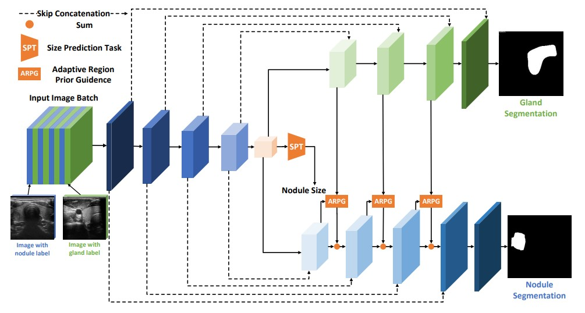

# TRFE-Plus: Thyroid Region Prior Guided Attention for Ultrasound Segmentation of Thyroid Nodules [journal](https://www.sciencedirect.com/science/article/pii/S0010482522010976)
Previous TRFE-Net in ISBI-2021: Multi-Task Learning for Thyroid Nodule Segmentation with Thyroid Region Prior [conference](https://www.researchgate.net/publication/349074982_MULTI-TASK_LEARNING_FOR_THYROID_NODULE_SEGMENTATION_WITH_THYROID_REGION_PRIOR)

## Introduction
Ultrasound segmentation of thyroid nodules is a challenging task, which plays an vital role in the diagnosis of thyroid cancer. However, the following two factors limit the development of automatic thyroid nodule segmentation algorithms: (1) existing automatic nodule segmentation algorithms that directly apply semantic segmentation techniques can easily mistake non-thyroid areas as nodules, because of the lack of the thyroid gland region perception, the large number of similar areas in the ultrasonic images, and the inherently low contrast images; (2) the currently available dataset (i.e., DDTI) is small and collected from a single center, which violates the fact that thyroid ultrasound images are acquired from various devices in real-world situations. To overcome the lack of thyroid gland region prior knowledge, we design a thyroid region prior guided feature enhancement network (TRFE+) for accurate thyroid nodule segmentation. Specifically, (1) a novel multi-task learning framework that simultaneously learns the nodule size, gland position, and the nodule position is designed; (2) an adaptive gland region feature enhancement module is proposed to make full use of the thyroid gland prior knowledge; (3) a normalization approach with respect to the channel dimension is applied to alleviate the domain gap during the training process. To facilitate the development of thyroid nodule segmentation, we have contributed TN3K: an open-access dataset containing 3493 thyroid nodule images with high-quality nodule masks labeling from various devices and views. We perform a thorough evaluation based on the TN3K test set and DDTI to demonstrate the effectiveness of the proposed method.

## Architecture

Overview of the proposed TRFE-Plus for thyroid nodule segmentation. 

### License
This code is released under the MIT License (refer to the LICENSE file for details).

## Instructions for Code:
### Requirements
python3.7-3.9
pytorch >= 1.5
torchvision >= 0.6.1
cuda >= 10.1

### Dataset and pretrained model
The compressed dataset is also available under the ``picture'' folder.

TN3K dataset and trained model: https://pan.baidu.com/s/1byqO5sBlt6OQdOxC4-SYng with extract code: trfe 

The dataset could also be downloaded at https://drive.google.com/file/d/1reHyY5eTZ5uePXMVMzFOq5j3eFOSp50F/view?usp=sharing

### Training and Evaluation
Please refer to train_trfe.sh and test_trfe.sh

## Citing
If you find this work useful in your research or use this dataset in your work, please consider citing the following papers:

```BibTex
@inproceedings{gong2021multi-task,  
  author={Gong, Haifan and Chen, Guanqi and Wang, Ranran and Xie, Xiang and Mao, Mingzhi and Yu, Yizhou and Chen, Fei and Li, Guanbin},  
  booktitle={2021 IEEE 18th International Symposium on Biomedical Imaging (ISBI)},   
  title={Multi-Task Learning For Thyroid Nodule Segmentation With Thyroid Region Prior},   
  year={2021}, 
  pages={257-261},  
  doi={10.1109/ISBI48211.2021.9434087}
}

@article{gong2022thyroid,
  title={Thyroid Region Prior Guided Attention for Ultrasound Segmentation of Thyroid Nodules},
  author={Gong, Haifan and Chen, Jiaxin and Chen, Guanqi and Li, Haofeng and Chen, Fei and Li, Guanbin},
  journal={Computers in Biology and Medicine},
  volume={106389},
  pages={1--12},
  year={2022},
  publisher={Elsevier}
}

```

The label for this dataset could refer to the following article, where 0 denotes for benign while 1 denotes for malignant.
```BibTex
@inproceedings{gong2022less,
  title={Less is More: Adaptive Curriculum Learning for Thyroid Nodule Diagnosis},
  author={Gong, Haifan and Cheng, Hui and Xie, Yifan and Tan, Shuangyi and Chen, Guanqi and Chen, Fei and Li, Guanbin},
  booktitle={International Conference on Medical Image Computing and Computer-Assisted Intervention},
  pages={248--257},
  year={2022},
  organization={Springer}
}
```

