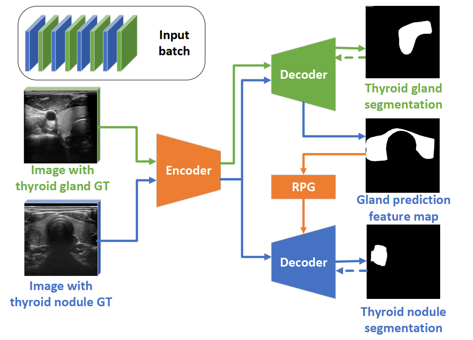
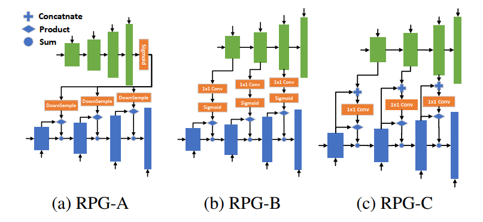

# Multi-Task Learning for Thyroid Nodule Segmentation with Thyroid Region Prior [link](https://www.researchgate.net/publication/349074982_MULTI-TASK_LEARNING_FOR_THYROID_NODULE_SEGMENTATION_WITH_THYROID_REGION_PRIOR)

## Introduction
Thyroid nodule segmentation in ultrasound images is a valuable and challenging task, and it is of great significance for the diagnosis of thyroid cancer. Due to the lack of the prior knowledge of thyroid region perception, the inherent low contrast of ultrasound images and the complex appearance changes between different frames of ultrasound video, existing automatic segmentation algorithms for thyroid nodules that directly apply semantic segmentation techniques can easily mistake non-thyroid areas as nodules. In this work, we propose a thyroid region prior guided feature enhancement network (TRFE-Net) for thyroid nodule segmentation. In order to facilitate the development of thyroid nodule segmentation, we have contributed TN3k: an open-access dataset of thyroid nodule images with high-quality nodule masks labeling. Our proposed method is evaluated on TN3k and shows outstanding performance compared with existing state-of-the-art algorithms.


## Architecture

Overview of the proposed TRFE-Net for thyroid nodule segmentation. 


Overview of the proposed RPG modules. 

### License
This code is released under the MIT License (refer to the LICENSE file for details).

## Instructions for Code:
### Requirements
python-3.7
pytorch-1.5.1
torchvision-0.6.1
cuda-10.1
gpu: TitanX 12GB

### Dataset and pretrained model
The compressed dataset is also available under the ``picture'' folder.

TN3K dataset and trained model: https://pan.baidu.com/s/1byqO5sBlt6OQdOxC4-SYng with extract code: trfe 

The dataset could also be downloaded at https://drive.google.com/file/d/1reHyY5eTZ5uePXMVMzFOq5j3eFOSp50F/view?usp=sharing

### Training and Evaluation
Training script.
```bash
python train.py -fold 0 -model_name trfe -dataset TATN -gpu 0
``` 

Evaluation script.
```bash
python eval.py -model_name trfe -load_path './run/run_0/trfe_best.pth'
```

## Citing
If you find this work useful in your research or use this dataset in your work, please consider citing the following papers:

```BibTex
@inproceedings{gong2021multi-task,  
  author={Gong, Haifan and Chen, Guanqi and Wang, Ranran and Xie, Xiang and Mao, Mingzhi and Yu, Yizhou and Chen, Fei and Li, Guanbin},  
  booktitle={2021 IEEE 18th International Symposium on Biomedical Imaging (ISBI)},   
  title={Multi-Task Learning For Thyroid Nodule Segmentation With Thyroid Region Prior},   
  year={2021}, 
  pages={257-261},  
  doi={10.1109/ISBI48211.2021.9434087}
}

@article{gong2022thyroid,
  title={Thyroid Region Prior Guided Attention for Ultrasound Segmentation of Thyroid Nodules},
  author={Gong, Haifan and Chen, Jiaxin and Chen, Guanqi and Li, Haofeng and Chen, Fei and Li, Guanbin},
  journal={Computers in biology and medicine},
  volume={0},
  pages={1--12},
  year={2022},
  publisher={Elsevier}
}

```

The label for this dataset could refer to 
```BibTex
@inproceedings{gong2022less,
  title={Less is More: Adaptive Curriculum Learning for Thyroid Nodule Diagnosis},
  author={Gong, Haifan and Cheng, Hui and Xie, Yifan and Tan, Shuangyi and Chen, Guanqi and Chen, Fei and Li, Guanbin},
  booktitle={International Conference on Medical Image Computing and Computer-Assisted Intervention},
  pages={248--257},
  year={2022},
  organization={Springer}
}
```

